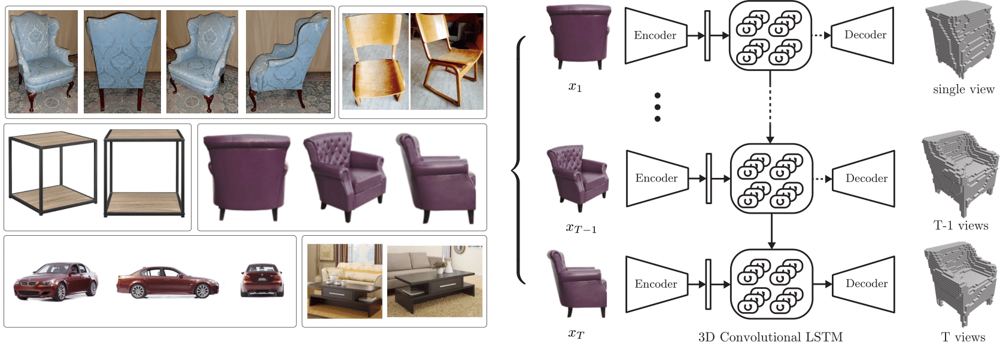
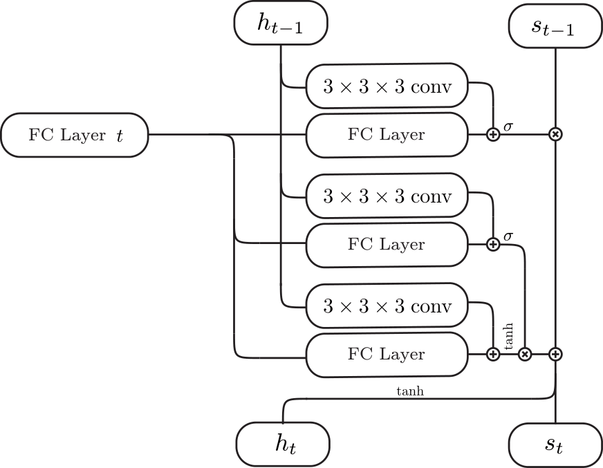
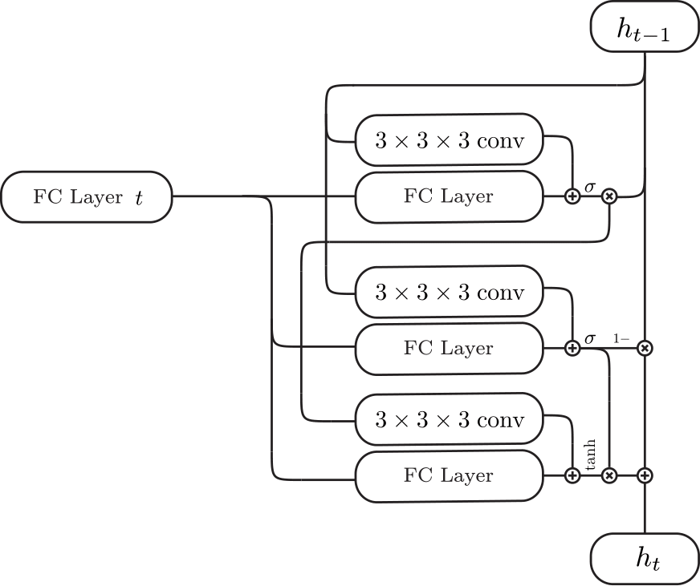
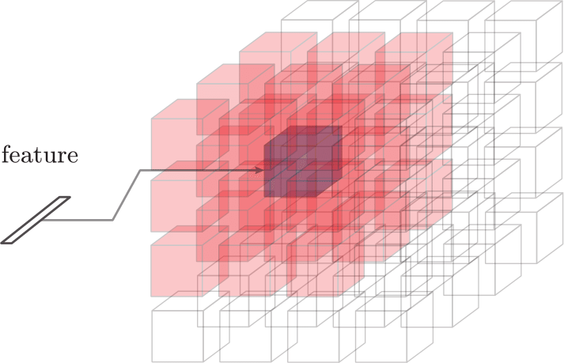

# 3D-R<sup>2</sup>N<sup>2</sup>: 3D Recurrent Reconstruction Neural Network

This repository contains the source codes for the paper [Choy et al., 3D-R2N2: A Unified Approach for Single and Multi-view 3D Object Reconstruction, ECCV 2016](http://arxiv.org/abs/1604.00449). Given one or multiple views of an object, the network generates voxelized ( a voxel is the 3D equivalent of a pixel) reconstruction of the object in 3D.

## Citing this work

If you find this work useful in your research, please consider citing:

```
@inproceedings{choy20163d,
  title={3D-R2N2: A Unified Approach for Single and Multi-view 3D Object Reconstruction},
  author={Choy, Christopher B and Xu, Danfei and Gwak, JunYoung and Chen, Kevin and Savarese, Silvio},
  booktitle = {Proceedings of the European Conference on Computer Vision ({ECCV})},
  year={2016}
}
```

## Project Page

The project page is available at [http://cvgl.stanford.edu/3d-r2n2/](http://cvgl.stanford.edu/3d-r2n2/).

## Overview


*Left: images found on Ebay, Amazon, Right: overview of `3D-R2N2`*

Traditionally, single view reconstruction and multi-view reconstruction are disjoint problems that have been dealt using different approaches. In this work, we first propose a unified framework for both single and multi-view reconstruction using a `3D Recurrent Reconstruction Neural Network` (3D-R2N2).

| 3D-Convolutional LSTM     | 3D-Convolutional GRU    | Inputs (red cells + feature) for each cell (purple) |
|:-------------------------:|:-----------------------:|:---------------------------------------------------:|
|  |  |                       |

We can feed in images in random order since the network is trained to be invariant to the order. The critical component that enables the network to be invariant to the order is the `3D-Convolutional LSTM` which we first proposed in this work. The `3D-Convolutional LSTM` selectively updates parts that are visible and keeps the parts that are self-occluded.


*We used two different types of networks for the experiments: a shallow network (top) and a deep residual network (bottom).*


## Results

Please visit the result [visualization page](http://3d-r2n2.stanford.edu/viewer/) to view 3D reconstruction results interactively.


## Datasets

We used [ShapeNet](http://shapenet.cs.stanford.edu) models to generate rendered images and voxelized models which are available below (you can follow the installation instruction below to extract it to the default directory).

- ShapeNet rendered images [ftp://cs.stanford.edu/cs/cvgl/ShapeNetRendering.tgz](ftp://cs.stanford.edu/cs/cvgl/ShapeNetRendering.tgz)
- ShapeNet voxelized models [ftp://cs.stanford.edu/cs/cvgl/ShapeNetVox32.tgz](ftp://cs.stanford.edu/cs/cvgl/ShapeNetVox32.tgz)
- Trained ResidualGRUNet Weights [ftp://cs.stanford.edu/cs/cvgl/ResidualGRUNet.npy](ftp://cs.stanford.edu/cs/cvgl/ResidualGRUNet.npy)


## Installation原始版(论文github给的安装)

The package requires python3. You can follow the direction below to install virtual environment within the repository or install anaconda for python 3.

- Download the repository

```
git clone https://github.com/chrischoy/3D-R2N2.git
```

- Setup virtual environment and install requirements and copy the theanorc file to the `$HOME` directory

```
cd 3D-R2N2
pip install virtualenv
virtualenv -p python3 --system-site-packages py3
source py3/bin/activate
pip install -r requirements.txt
cp .theanorc ~/.theanorc
```

## Installation实际版(我用学校的gpu时的安装)

- 查看gpu状态
```
nvidia-smi
```
```
+-----------------------------------------------------------------------------+
| NVIDIA-SMI 384.90                 Driver Version: 384.90                    |
|-------------------------------+----------------------+----------------------+
| GPU  Name        Persistence-M| Bus-Id        Disp.A | Volatile Uncorr. ECC |
| Fan  Temp  Perf  Pwr:Usage/Cap|         Memory-Usage | GPU-Util  Compute M. |
|===============================+======================+======================|
|   0  GeForce GTX 108...  Off  | 00000000:03:00.0 Off |                  N/A |
| 50%   83C    P2    89W / 250W |   1329MiB / 11172MiB |      1%      Default |
+-------------------------------+----------------------+----------------------+
                                                                               
+-----------------------------------------------------------------------------+
| Processes:                                                       GPU Memory |
|  GPU       PID   Type   Process name                             Usage      |
|=============================================================================|
+-----------------------------------------------------------------------------+
```
- 查看cuda版本
```
nvcc --version
```
```
nvcc: NVIDIA (R) Cuda compiler driver
Copyright (c) 2005-2016 NVIDIA Corporation
Built on Tue_Jan_10_13:22:03_CST_2017
Cuda compilation tools, release 8.0, V8.0.61
```
- 安装cudnn(来自[installation guide](http://docs.nvidia.com/deeplearning/sdk/cudnn-install/index.html#installlinux-deb)但是版本不一样)
```
cd <cudnnpath>
```
Install the runtime library
```
sudo dpkg -i libcudnn7_7.1.1.5-1+cuda8.0_amd64.deb
```
Install the developer library
```
sudo dpkg -i libcudnn7-dev_7.1.1.5-1+cuda8.0_amd64.deb
```
Install the code samples and the cuDNN Library User Guide
```
sudo dpkg -i libcudnn7-doc_7.1.1.5-1+cuda8.0_amd64.deb
```
- Verifying(和它网站上的一样)

http://docs.nvidia.com/deeplearning/sdk/cudnn-install/index.html#verify

- 安装anaconda
```
bash Anaconda3-5.1.0-Linux-x86_64.sh
```
- 用conda安装libpygpu(theano gpu backend)
好像是这个，但是这个gpu backend好像是老的，新的是pygpu，在theano的conda-forge里装的有
```
conda install -c anaconda libgpuarray
```
- 用conda安装theano
```
conda install -c conda-forge theano 
```
- 测试theano能不能用gpu(来自[testing theano with gpu](http://deeplearning.net/software/theano/tutorial/using_gpu.html))
```
```
### Running demo.py

- Install meshlab (skip if you have another mesh viewer). If you skip this step, demo code will not visualize the final prediction.

```
sudo apt-get install meshlab
```

- Run the demo code and save the final 3D reconstruction to a mesh file named `prediction.obj`

```
python demo.py prediction.obj
```

The demo code takes 3 images of the same chair and generates the following reconstruction.

| Image 1         | Image 2         | Image 3         | Reconstruction                                                                            |
|:---------------:|:---------------:|:---------------:|:-----------------------------------------------------------------------------------------:|
|  |  |  |  |

- Deactivate your environment when you are done

```
deactivate
```


### Training the network

- Activate the virtual environment before you run the experiments.

```
source py3/bin/activate
```

- Download datasets and place them in a folder named `ShapeNet`

```
mkdir ShapeNet/
wget ftp://cs.stanford.edu/cs/cvgl/ShapeNetRendering.tgz
wget ftp://cs.stanford.edu/cs/cvgl/ShapeNetVox32.tgz
tar -xzf ShapeNetRendering.tgz -C ShapeNet/
tar -xzf ShapeNetVox32.tgz -C ShapeNet/
```

- Train and test the network using the training shell script

```
./experiments/script/res_gru_net.sh
```

**Note**: The initial compilation might take awhile if you run the theano for the first time due to various compilations. The problem will not persist for the subsequent runs.


## Using cuDNN

To use `cuDNN` library, you have to download `cuDNN` from the nvidia [website](https://developer.nvidia.com/rdp/cudnn-download). Then, extract the files to any directory and append the directory to the environment variables like the following. Please replace the `/path/to/cuDNN/` to the directory that you extracted `cuDNN`.

```
export LD_LIBRARY_PATH=/path/to/cuDNN/lib64:$LD_LIBRARY_PATH
export CPATH=/path/to/cuDNN/include:$CPATH
export LIBRARY_PATH=/path/to/cuDNN/lib64:$LD_LIBRARY_PATH
```

For more details, please refer to [http://deeplearning.net/software/theano/library/sandbox/cuda/dnn.html](http://deeplearning.net/software/theano/library/sandbox/cuda/dnn.html)


## Follow-up Paper

Gwak et al., [Weakly supervised 3D Reconstruction with Adversarial Constraint](https://arxiv.org/abs/1705.10904), [project website](http://cvgl.stanford.edu/mcrecon/)

Supervised 3D reconstruction has witnessed a significant progress through the use of deep neural networks. However, this increase in performance requires large scale annotations of 2D/3D data. In this paper, we explore inexpensive 2D supervision as an alternative for expensive 3D CAD annotation. Specifically, we use foreground masks as weak supervision through a raytrace pooling layer that enables perspective projection and backpropagation. Additionally, since the 3D reconstruction from masks is an ill posed problem, we propose to constrain the 3D reconstruction to the manifold of unlabeled realistic 3D shapes that match mask observations. We demonstrate that learning a log-barrier solution to this constrained optimization problem resembles the GAN objective, enabling the use of existing tools for training GANs. We evaluate and analyze the manifold constrained reconstruction on various datasets for single and multi-view reconstruction of both synthetic and real images.


## License

MIT License
